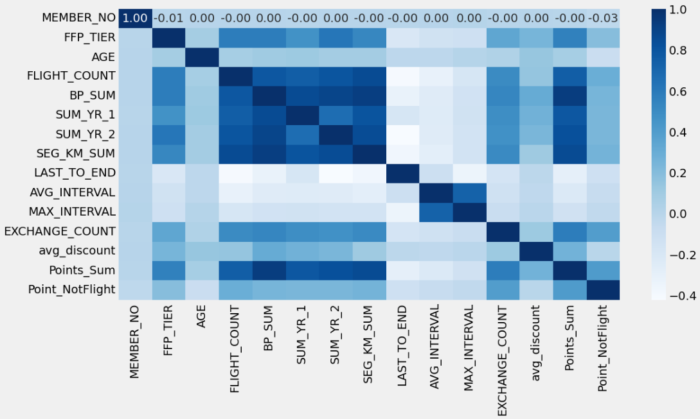
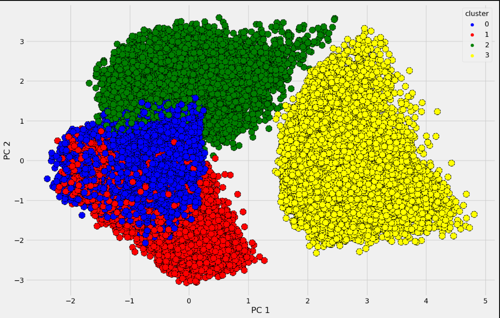
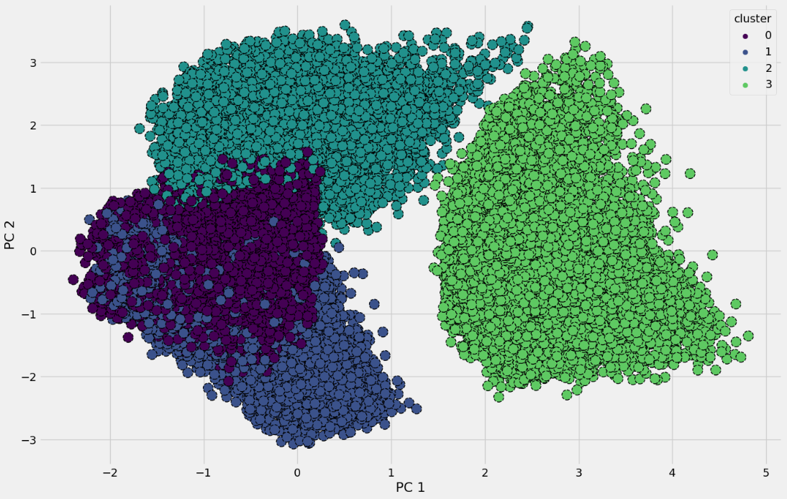

# Airline Customer Value Analysis with K-means Clustering

## **Introduction**
This project aims to analyze customer value within the airline industry using K-means clustering. By segmenting customers based on their purchasing behavior and other relevant metrics, the analysis helps to identify patterns and trends, enabling airlines to develop targeted marketing strategies and improve customer retention.

### **Objectives**
- Perform clustering to segment customers based on behavior and value.
- Identify key insights to enhance marketing and operational efficiency.
- Provide actionable recommendations for improving customer satisfaction and loyalty.

## **Dataset Description**
- **Source**: Brief description of where the dataset originates (e.g., internal airline records or public datasets).
- **Features**: Key attributes in the dataset, such as:
  - **Customer ID**: Unique identifier for each customer.
  - **Annual Revenue**: Total revenue generated by the customer.
  - **Flight Frequency**: Number of flights taken within a specific period.
  - **Service Preferences**: Indicators of customer preferences (e.g., class, additional services).
- **Preprocessing**: Outline data cleaning steps like handling missing values, normalizing features, and encoding categorical variables.

## **Methodology**
### **Data Preprocessing**
- **Scaling**: Normalized the dataset using standardization techniques to ensure uniformity.
- **Feature Selection**: Selected relevant features based on domain knowledge and exploratory data analysis.

### **Clustering with K-means**
- **Algorithm Selection**: Used K-means clustering due to its efficiency in segmenting large datasets.
- **Optimal Cluster Identification**: Applied techniques like the Elbow Method and Silhouette Analysis to determine the optimal number of clusters.

### **Evaluation**
- Evaluated cluster quality using metrics such as:
  - Intra-cluster variance
  - Silhouette coefficient

## **Results**
- **Customer Segments**: 
  - Cluster 1: High-value customers who prefer premium services.
  - Cluster 2: Budget-conscious travelers with infrequent travel.
  - Cluster 3: Moderate-value customers who prioritize cost and convenience.
- **Insights**:
  - High-value customers contribute disproportionately to revenue.
  - Budget-conscious travelers present opportunities for upselling basic amenities.

### **Visualization**
- Scatter plots and heatmaps to visualize cluster distributions.
- Bar charts summarizing key statistics within each cluster.

## **Conclusion**
- **Summary**: Highlighted customer behavior trends and segmented the customer base for targeted marketing.
- **Business Implications**:
  - Tailored loyalty programs for high-value customers.
  - Cost-efficient packages to attract budget-conscious travelers.
- **Future Work**: Incorporate additional customer data (e.g., feedback, social media activity) to refine segmentation further.

## **Usage Instructions**
1. **Environment Setup**:
   - Install required libraries: `scikit-learn`, `pandas`, `matplotlib`, etc.
   - Ensure Python 3.x is installed.
2. **Execution**:
   - Run the preprocessing script to clean and prepare the data.
   - Execute the K-means clustering model script to perform segmentation.
   - Visualize results using the provided plotting scripts.

## 
 

---

## P.S.  
If you need the rest of the documentation or the complete paper, please feel free to email me at [thenomaniqbal@gmail.com](mailto:thenomaniqbal@gmail.com).  

This project is part of my GitHub directory. Contributions and feedback are always welcome!

---
